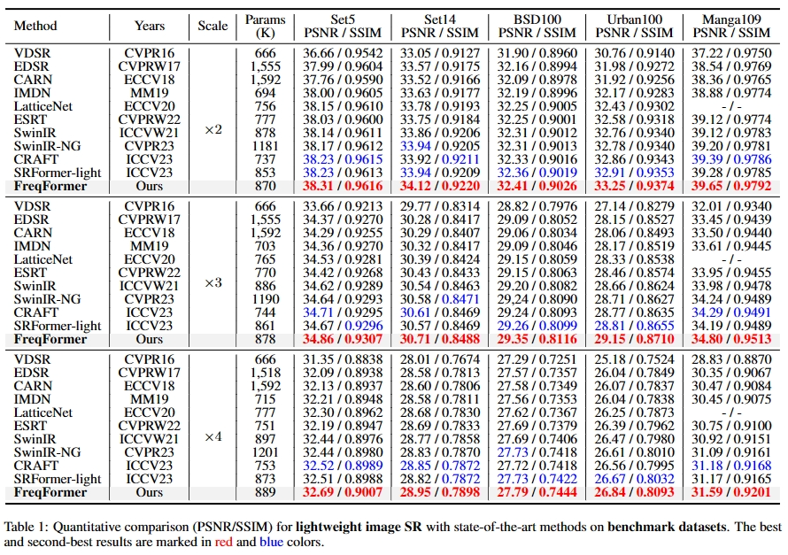

## FreqFormer: Frequency-aware Transformer for Lightweight Image Super-resolution

[Tao Dai](https://cstaodai.com/), [Jianping Wang](https://github.com/JPWang-CS), [Hang Guo](https://github.com/csguoh), 
[Jinmin Li](https://github.com/THU-Kingmin), Jinbao Wang\* and Zexuan Zhu\*

> **Abstract:** Transformer-based models have been widely and successfully used in various low-vision visual tasks, and have achieved remarkable performance in single image super-resolution (SR). Despite the significant progress in SR, Transformer-based SR methods (**e.g.,** SwinIR) still suffer from the problems of heavy computation cost and low-frequency preference, while ignoring the reconstruction of rich high-frequency information, hence hindering the representational power of Transformers. To address these issues, in this paper, we propose a novel Frequency-aware Transformer (FreqFormer) for lightweight image SR. Specifically, a Frequency Division Module (FDM) is first introduced to separately handle high- and low-frequency information in a divide-and-conquer manner. Moreover, we present Frequency-aware Transformer Block (FTB) to extracting both spatial frequency attention and channel transposed attention to recover high-frequency details. Extensive experimental results on public datasets demonstrate the superiority of our FreqFormer over state-of-the-art SR methods in terms of both quantitative metrics and visual quality. 

<p align="center">
    
</p>


---

## Results

We achieve state-of-the-art performance on various image super-resolution tasks. Detailed results can be found in the paper.

**Evaluation on light-weight SR**
<p align="center">

</p>

---

## Installation

This codebase was tested with the following environment configurations. It may work with other versions.

- Ubuntu 22.04
- CUDA 12.0
- Python 3.11
- PyTorch 2.1.0 + cu121

We suggest installing the appropriate version of PyTorch based on your hardware configuration.

```shell
git clone https://github.com/JPWang-CS/FreqFormer.git
conda create -n FreqFormer python=3.11
conda activate FreqFormer
pip install -r requirements.txt
python setup.py develop
```


---

## Datasets

Used training and testing sets can be downloaded as follows:

| Training Set                                                                                                                                                                                                                                                                                                         |                                                                                Testing Set                                                                                 |                        Visual Results                        |
|:---------------------------------------------------------------------------------------------------------------------------------------------------------------------------------------------------------------------------------------------------------------------------------------------------------------------|:--------------------------------------------------------------------------------------------------------------------------------------------------------------------------:| :----------------------------------------------------------: |
| [DIV2K](https://data.vision.ee.ethz.ch/cvl/DIV2K/) (800 training images, 100 validation images) +  [Flickr2K](https://cv.snu.ac.kr/research/EDSR/Flickr2K.tar) (2650 images) [complete training dataset DF2K: [Google Drive](https://drive.google.com/file/d/1TubDkirxl4qAWelfOnpwaSKoj3KLAIG4/view?usp=share_link)] | Set5 + Set14 + BSD100 + Urban100 + Manga109 [complete testing dataset: [Google Drive](https://drive.google.com/file/d/1yMbItvFKVaCT93yPWmlP3883XtJ-wSee/view?usp=sharing)] |           TODO |

Download training and testing datasets and put them into the corresponding folders of `datasets/`. See [datasets](datasets/README.md) for the detail of the directory structure.

## Training

- Download [training](https://drive.google.com/file/d/1TubDkirxl4qAWelfOnpwaSKoj3KLAIG4/view?usp=share_link) (DF2K, already processed) and [testing](https://drive.google.com/file/d/1yMbItvFKVaCT93yPWmlP3883XtJ-wSee/view?usp=sharing) (Set5, Set14, BSD100, Urban100, Manga109, already processed) datasets, place them in `datasets/`.

- Run the following scripts. The training configuration is in `options/train/`.

```shell
  # CUDA_VISIBLE_DEVICES=0,1 to choose gpus
  # FreqFormer_x2, input=64x64, 2 GPUs
  python -m torch.distributed.run --nproc_per_node=2 --master_port=4321 basicsr/train.py -opt options/Train/train_FreqFormer_x2.yml --launcher pytorch
  # FreqFormer_x3, input=64x64, 2 GPUs
  python -m torch.distributed.run --nproc_per_node=2 --master_port=4321 basicsr/train.py -opt options/Train/train_FreqFormer_x3.yml --launcher pytorch
  # FreqFormer_x4, input=64x64, 2 GPUs
  python -m torch.distributed.run --nproc_per_node=2 --master_port=4321 basicsr/train.py -opt options/Train/train_FreqFormer_x4.yml --launcher pytorch
  
```
  
- The training results is in `experiments/`.

---

## Testing

Coming soon.


---

## Citation

If you find the code helpful in your research or work, please cite the following paper(s).
```
@inproceedings{freq2024,
    title={FreqFormer: Frequency-aware Transformer for Lightweight Image Super-resolution},
    author={Tao Dai, Jianping Wang, Hang Guo, Jinmin Li, Jinbao Wang and Zexuan Zhu},
    booktitle={IJCAI},
    year={2024}
}
  ```
---
## Acknowledgements
This code is built on  [BasicSR](https://github.com/XPixelGroup/BasicSR).
